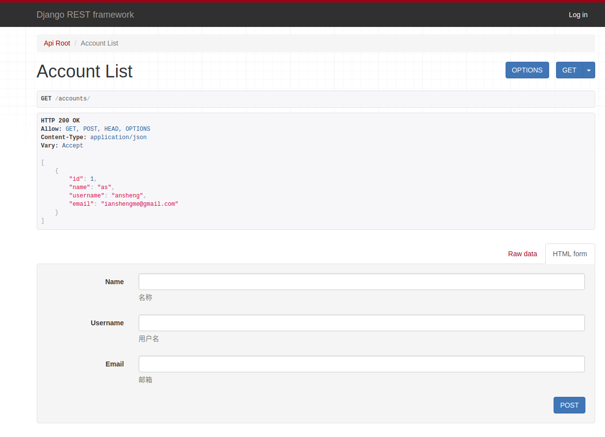

# Django中使用Oracle数据库

本文假设你已经安装好了`Docker`与`Python`的虚拟环境。

## 环境

- Ubuntu Linux 17.04
- Docker version 17.09.0-ce, build afdb6d4
- Oracle Database 12.2.0.1 Enterprise Edition
- Python 3.6.3
- Django 1.11.6
- djangorestframework 3.7.0

## 安装Oracle

借助于强力的`Docker`，让我们安装`Oracle`数据库变得更简单，而不是花很久的时间来安装数据库，让我们来体验一下`Docker`的强大之处吧。

### 下载所需软件包

- Download the Oracle Docker build files.

> Repo URL: https://github.com/oracle/docker-images

- Download `Oracle Database 12c Release 2` for Linux x86-64

> Download URL：http://www.oracle.com/technetwork/database/enterprise-edition/downloads/index.html

- 你现在应该有两个文件

```bash
~/Downloads$ ls -l
总用量 3379844
-rw-r--r-- 1 ansheng ansheng    7248413 10月 16 15:55 docker-images-master.zip
-rw-r--r-- 1 ansheng ansheng 3453696911 10月 15 16:22 linuxx64_12201_database.zip
```

### 准备工作

解压`docker-images-master.zip`

```bash
~/Downloads$ unzip docker-images-master.zip
```

拷贝`linuxx64_12201_database.zip`文件到`docker-images-master/OracleDatabase/dockerfiles/12.2.0.1`目录下，因为我们下载的是`12.2.0.1`版本，所以需要拷贝到`12.2.0.1`目录下。

```bash
~/Downloads$ cp linuxx64_12201_database.zip docker-images-master/OracleDatabase/dockerfiles/12.2.0.1/
```

### 构建Docker镜像

`Oracle`为我们提供了快速构建镜像的脚本，我们只需要指定构建的版本即可，但请确保你的网络是流畅的，因为在构建的过程中会更新和安装一些软件包。

```bash
~/Downloads$ cd docker-images-master/OracleDatabase/dockerfiles/
~/Downloads/docker-images-master/OracleDatabase/dockerfiles$ sudo ./buildDockerImage.sh -v 12.2.0.1 -e
```

然后就会开始构建镜像了，这个过程是漫长的，因为我用的是`Ubuntu`，所以执行的时候需要加`sudo`权限，脚本的参数`-v`指定要构建的版本，`-e`根据`企业版`创建镜像。

> 更多的参数请访问：https://github.com/oracle/docker-images/tree/master/OracleDatabase#building-oracle-database-docker-install-images

当构建完毕之后我们通过`sudo docker images`指令来查看构建好的镜像

```bash
~/Downloads/docker-images-master/OracleDatabase/dockerfiles$ sudo docker images
REPOSITORY          TAG                 IMAGE ID            CREATED              SIZE
oracle/database     12.2.0.1-ee         7ace5bfa1100        About a minute ago   13.2GB
oraclelinux         7-slim              a6e9e9e5ddc1        2 weeks ago          118MB
```

上面的镜像中，`oracle/database`就是根据`oraclelinux`来构建的，构建出来的镜像还是挺大的

### 启动一个Oracle容器

执行以下指令启动容器

```bash
~/Downloads/docker-images-master/OracleDatabase/dockerfiles$ cd
~$ sudo docker run -d --name oracle -p 1521:1521 -p 5500:5500 -e ORACLE_SID=ansheng -e ORACLE_PWD=ansheng.me oracle/database:12.2.0.1-ee
affc07af4da51f03c67db1cb7266bd66aef442c71793a216ce2be4e5349b0cbd
```

启动参数解释如下：

|参数|描述|
|:--|:--|
|`-d`|后台运行|
|`--name`|指定容器运行的名称|
|`-p`|制定映射的端口|
|`-e ORACLE_SID`|第一次创建容器创建一个默认的SID|
|`-e ORACLE_PWD`|密码|

上面的启动参数可以有更多，请参考https://github.com/oracle/docker-images/tree/master/OracleDatabase#building-oracle-database-docker-install-images

你还可以通过`docker logs`来查看启动日志，启动过程有点慢...

```bash
~$ sudo docker logs -f oracle
```

容器启动完成之后可以测试连接

```bash
$ sudo docker exec oracle sqlplus sys/ansheng.me@//localhost:1521/ansheng as sysdba
```

你还可以执行以下执行来更改密码

```bash
～$ docker exec oracle ./setPassword.sh <Your Password>
```

容器内的`Oracle数据库`还配置了`Oracle Enterprise Manager Express`，要访问`OEM Express`，请启动浏览器并按照以下URL：

```
https://localhost:5500/em/
```

## 配置Django项目

请先切换到虚拟环境在进行以下操作，我使用的是`pyenv`

```bash
~$ pyenv activate venv 
(venv) ~$ 
```

- 安装django与djangorestframework

```bash
(venv) ~$ pip install django djangorestframework
```

- 创建项目

```bash
(venv) ~$ django-admin startproject ansheng
```

- 创建app

```bash
(venv) ~$ cd ansheng/
(venv) ~/ansheng$ python manage.py startapp july
```

- july/models.py

```python
from django.db import models


# Create your models here.

class Love(models.Model):
    name = models.CharField(max_length=12, null=True, blank=True, help_text='名称')
    username = models.CharField(max_length=32, help_text='用户名')
    email = models.EmailField(help_text='邮箱')
```

- july/views.py 

```python
from .models import Account
from rest_framework import serializers, viewsets


# Create your serializers here.

class AccountSerializer(serializers.ModelSerializer):
    class Meta:
        model = Account
        fields = '__all__'


# Create your views here.

class AccountViewSet(viewsets.ModelViewSet):
    queryset = Account.objects.all()
    serializer_class = AccountSerializer
```

- ansheng/urls.py

```python
from django.conf.urls import url, include
from rest_framework.routers import DefaultRouter

from july.views import AccountViewSet

router = DefaultRouter()
router.register('accounts', AccountViewSet, base_name='accounts')

urlpatterns = [
    url(r'^', include(router.urls)),
    url(r'^api-auth/', include('rest_framework.urls', namespace='rest_framework'))
]
```

- ansheng/settings.py

```python
INSTALLED_APPS = [
    ...
    'rest_framework',
    'july'
]
```

### 配置Oracle数据库

`cx-Oracle`是`django`连接`oracle`的一个库

```bash
(venv) ~/ansheng$ pip3 install cx-Oracle
```

将`ansheng/settings.py`中的`DATABASES`替换为

```python
DATABASES = {
    'default': {
        'ENGINE': 'django.db.backends.oracle',
        'NAME': 'ansheng',
        'USER': 'system',
        'PASSWORD': 'ansheng.me',
        'HOST': '127.0.0.1',
        'PORT': '1521',
    }
}
```

要在`Linux`上面连接`Oracle`，你还需要安装客户端的一些lib，可以在http://www.oracle.com/technetwork/topics/linuxx86-64soft-092277.html中下载，下载后的文件如下：

```bash
(venv) ~/ansheng$ cd ~/Downloads/
(venv) ~/Downloads$ ls -l
-rw-r--r--  1 ansheng ansheng   52826628 10月 16 17:06 oracle-instantclient12.2-basic-12.2.0.1.0-1.x86_64.rpm
-rw-r--r--  1 ansheng ansheng     606864 10月 16 17:00 oracle-instantclient12.2-devel-12.2.0.1.0-1.x86_64.rpm
-rw-r--r--  1 ansheng ansheng     708104 10月 16 17:00 oracle-instantclient12.2-sqlplus-12.2.0.1.0-1.x86_64.rpm
```

因为我用的是`Ubuntu`不能直接安装`rpm`,所以需要借助`alien`来把`rpm`包转换为`deb`包

```bash
# 安装alien
(venv) ~/Downloads$ sudo apt-get install alien
# 借助alien进行安装
(venv) ~/Downloads$ sudo alien -i oracle-instantclient12.2-basic-12.2.0.1.0-1.x86_64.rpm
(venv) ~/Downloads$ sudo alien -i oracle-instantclient12.2-devel-12.2.0.1.0-1.x86_64.rpm
(venv) ~/Downloads$ sudo alien -i oracle-instantclient12.2-sqlplus-12.2.0.1.0-1.x86_64.rpm
# 安装所需要的库
(venv) ~/Downloads$ sudo apt-get install libaio1
```

> 我们使用的Oracle是12.2版本的，所以一定要下载和Oracle一样的版本，不然是不能使用的

环境配置

```bash
(venv) ~/Downloads$ vim /etc/ld.so.conf
......
/usr/lib/oracle/12.2/client64/lib/
```

重新加载库文件

```bash
(venv) ~/Downloads$ sudo ldconfig
```

执行以下执行生成临时变量，这些配置都是针对当前窗口生效的，如果你想永久生效，可以加入用户的`~/.bashrc`文件中

```bash
(venv) ~/Downloads$ export ORACLE_HOME=/usr/lib/oracle/12.2/client64
(venv) ~/Downloads$ export ORACLE_BASE=/usr/lib/oracle/12.2
(venv) ~/Downloads$ export LD_LIBRARY_PATH=${LD_LIBRARY_PATH}:$ORACLE_HOME/lib
(venv) ~/Downloads$ export PATH=$PATH:$ORACLE_HOME/bin
```

## 测试

进入项目目录，生成数据库表

```bash
(venv) ~/Downloads$ cd ~/ansheng/
(venv) ~/ansheng$ python manage.py migrate
```

生成`july`表结构

```bash
(venv) ~/ansheng$ python manage.py makemigrations july
(venv) ~/ansheng$ python manage.py migrate
```

启动项目

```bash
(venv) ~/ansheng$ python manage.py runserver
```

然后浏览器打开`http://127.0.0.1:8000/accounts/`，进行增删改查试下呗


